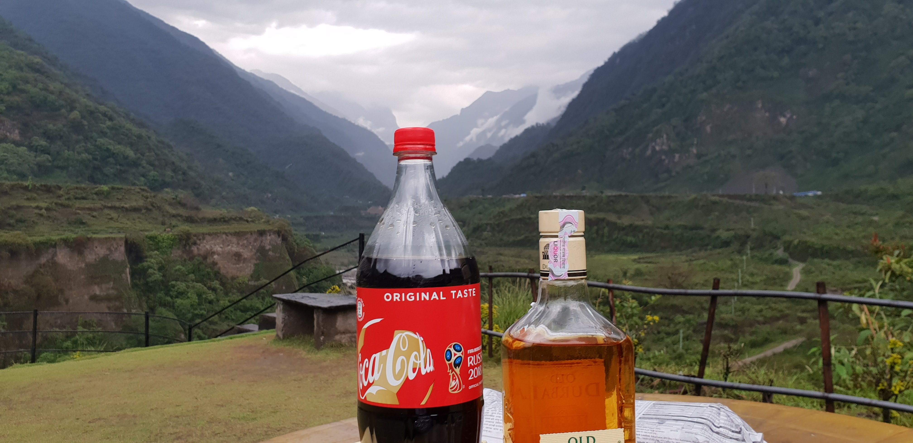
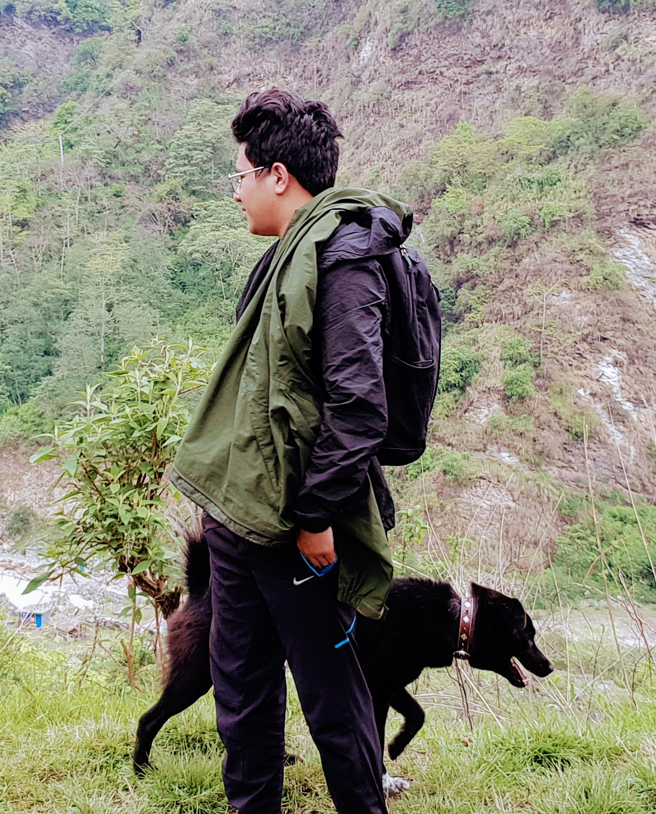

Lately It's been getting quite monotonous. Going to work and back with little time to spend on myself has been a daily routine for quite a time now. Well I also had to try out my s9 camera on some good landscapes.So I decided to leave for Pokhara. **Since** there was a holiday in buddhajayenti and I took a leave for day after from office resulting in 4 days off from office including weekends. Since It would take a whole day to reach Pokhara from Kathmandu , I had already wasted my two days of my short vacation. I packed my kindle with **The Alchemist** Paulo Coelo for a reread during my trip. I have been getting recommendation of **Norwegian Wood** from a coworker, Maybe I will read that next time. Next day I meet up with old pal and decided to go to TatoPani resort near Pokhara.We set off around 5 pm and reached at our destination about 7 pm. The road was quite good but it was raining all the way.

 <i>
Loved this view .Coke and old durbar never tested so much better.</i> 

The view made it worth the rainy trip.I recommend it to anyone who wants to get in touch with nature. [Tatopani Resort](https://www.facebook.com/BhurjungKholaTatopani/)

 <i>Made a new friend </i>:heart_eyes: 

